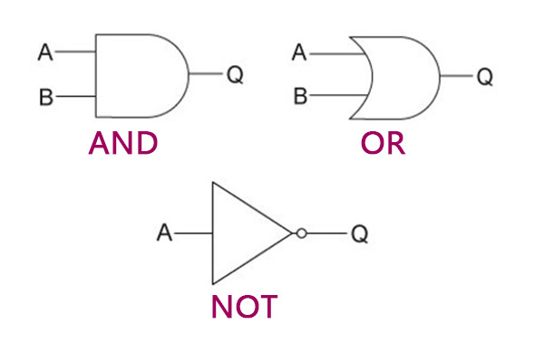

# Gates

_Note: The terms "function" and "(logic) gate" are used interchangeably._

## Boolean functions

A logic gate is a boolean function, that performs some operations on one or more inputs, and produces a single output. Let's show one you know: 

\text{Not}(a)=\overline{a}

\
This defines a function called "Not", that takes one input $$(a)$$ and returns back the negated input. The line above $$\overline{a}$$ is just a convenient notation for writing down boolean algebra; in practice, we can use functions/gates only.&#x20;

In physics, circuits can implement logic gates of many kinds to perform some kind of boolean calculation on voltages. 1 is a high voltage and 0 is a no/low voltage. Most basic types of gates have a well-established symbol for them. For example:&#x20;

<figure><figcaption>
<em>Diagram of Not logic gate // Source:</em> <a href="https://graphicmaths.com/computer-science/logic/logic-gates/">graphicmaths.com</a>
</figcaption></figure>

\
Gates can take more inputs, and perform multiple calculations. In this sense, boolean functions are principally the same as elementary mathematical functions. Only instead of plotting it on a graph we make a truth table. Let's show a more complicated gate: 

\text{XNOR}(a,b)=\overline{a\overline{b}+\overline{a}b}

\
This one takes two numbers, and returns one. If you're ever confused about what a specific gate/function does, just build a truth table.

| a | b | XNOR(a, b) |
| - | - | ---------- |
| 0 | 0 | 1          |
| 0 | 1 | 0          |
| 1 | 0 | 0          |
| 1 | 1 | 1          |

We can see that the XNOR gate produces 1 when its inputs are equal. In standard math, you may have seen this notated as $$a\leftrightarrow b$$ .\
 

## Starterpack

During reading this, you may have wondered - since $$\overline{a}=\text{Not}(a)$$, what about the symbols $$+,\cdot~$$ ? Are they also gates? Yes, indeed, they are. And the definition is very straightforward. Here are the three gates you already know; the starterpack for your journey.  

\text{Not}(a)=\overline{a}

\text{And}(a,b)=a\cdot b

\text{Or}(a,b)=a+b

And here are their gate diagrams, if you wondered:

<figure><figcaption>
<em>Source:</em> <a href="https://learncomputing.org/revision/gcse/2-4"><em>learncomputing.org</em></a>
</figcaption></figure>
