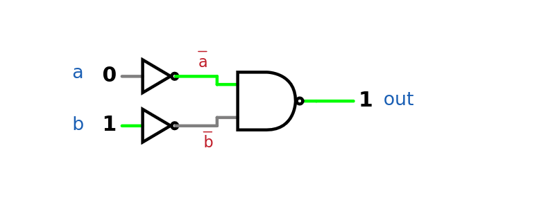

# OR

## Expected functionality

<div data-with-frame="true"><figure><figcaption><p><a href="https://www.falstad.com/s.php?s=3p1Euc"><em><strong>Click here for the interactive verison</strong></em></a></p></figcaption></figure></div>

## Definition

```
if (a or b) out = 1, else out = 0
```

#### $$\text{OR}(a,b)=a+b$$

<table><thead><tr><th width="63.199981689453125">a</th><th width="55.39996337890625">b</th><th width="123.79995727539062">OR(a,b)</th></tr></thead><tbody><tr><td>0</td><td>0</td><td>0</td></tr><tr><td>0</td><td>1</td><td>1</td></tr><tr><td>1</td><td>0</td><td>1</td></tr><tr><td>1</td><td>1</td><td>1</td></tr></tbody></table>

## Implementation

<details>

<summary>Hint #1</summary>

Take a look at [laws-of-booleans.md](../theory/laws-of-booleans.md "mention"). Think about the algebraic definition of NAND. Try to transform the definition of OR into it.&#x20;

</details>

<details>

<summary>Hint #2</summary>

Try to apply one of the advanced boolean laws that brings you closer to $$\overline{ab}$$.

</details>

<details>

<summary>Hint #3</summary>

I wonder if there's a nifty 1-NAND gate that could let me inverse numbers, so that it finally clicks.

</details>

<details>

<summary>Hint #4</summary>

Using 2 NOT gates and a single NAND gate, can you crack it?

</details>

<details>

<summary>Solution (3 NANDs)</summary>

$$a+b=\overline{\overline{a}\cdot\overline{b}}=\text{NAND}(\overline{a},\overline{b})$$

$$\overline{a}=\text{NOT}(a)$$

$$\overline{b}=\text{NOT}(b)$$

```
CHIP Or {
    IN a, b;
    OUT out;

    PARTS:
    Not(in=a,out=nota);
    Not(in=b,out=notb);
    Nand(a=nota,b=notb,out=out);
}
```

<div data-with-frame="true"><figure><figcaption><p><a href="https://www.falstad.com/s.php?s=fQyaNs"><em><strong>Click here for the interactive version</strong></em></a></p></figcaption></figure></div>

</details>
